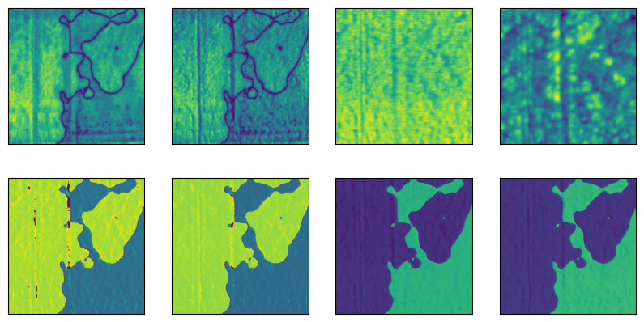
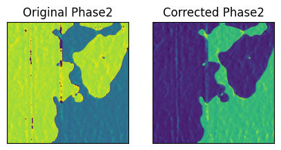
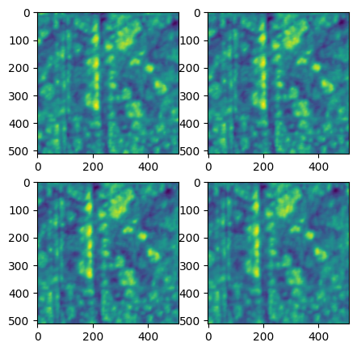
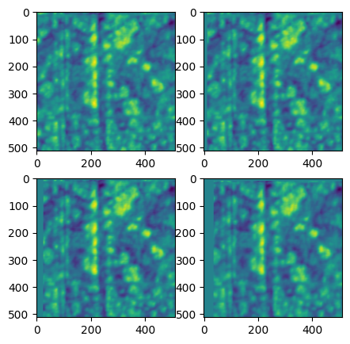
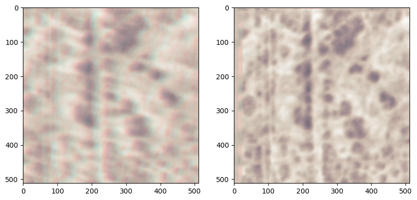

======================================
Walkthrough: How Does Hystorian Works?
======================================

.. code:: ipython3

    from hystorian.io import HyFile, HyPath
    
    from pathlib import Path
    import numpy as np
    import matplotlib.pyplot as plt
    import glob

.. code:: ipython3

    import os
    # Cleanup the environment:
    os.remove('pfm1.hdf5') if os.path.exists('pfm1.hdf5') else None
    os.remove('pfm2.hdf5') if os.path.exists('pfm2.hdf5') else None

1. How to extract the data?
===========================

Using ``HyExtractor``
---------------------

The simplest (but not recommended) way to extract the data is to use the
``HyExtractor`` class. It will extract the data from a supported file
and return a dictionary with the data, metadata, and attributes.

.. code:: python

   from hystorian.io import HyExtractor
   datapath1 = "path/to/your/file.hystorian"
   d = HyExtractor.extract(datapath1)

To access the data, metadata, and attributes, you can use the following
attributes:

.. code:: python

   d.data        # The data extracted from the file
   d.metadata    # The metadata of the file
   d.attributes  # The attributes of the file

This can be used for quick and dirty extraction of the data, during the
exploratory phase of your project. However, it is not recommended for
production code, as it does not allow to store the future processing in
the same file, and does not allow to store the data in a structured way.

Using ``HyFile``
-----------------

The proper way to extract the data is to use the ``HyFile`` class. It
allows to store the data, metadata, and attributes in a structured way,
and allows to store the future processing in the same file.

HyFile as a ``__enter__`` and ``__exit__`` methods, so it can be used in
a ``with`` statement. This will ensure that the file is properly closed
after the processing is done.

HyFile support the following modes to open the file: - ``r``: Readonly,
file must exist. (default) - ``r+``: Read/write, file must exist. -
``w``: Create file, truncate if exists. - ``w-`` or ``x``: Create file,
fail if exists. - ``a`` : Read/write if exists, create otherwise.

(Note: Due to a bug, ``r+`` works like ``a`` in the current version of
Hystorian, this will be fixed soon)

.. code:: ipython3

    with HyFile('pfm1.hdf5', 'a') as f: # The file did not exist before so it is created
        ... # We do nothing 

Now, to add the data from an IBW file to a HDF5 file, you can use the
following code:

.. code:: ipython3

    datapath1 = Path("data/P3_00_Const_3000mV_0032.ibw") # This is the path to the IBW file you want to add
    
    with HyFile('pfm1.hdf5', 'r+') as f:
        f.extract_data(datapath1)

Using ``merge()`` it is possible to merge two hdf5 files together.

.. code:: ipython3

    datapath2 = Path("data/P3_00_Const_3000mV_0034.ibw")
    
    with HyFile('pfm2.hdf5', 'r+') as f:
        f.extract_data(datapath2)
    
    with HyFile('pfm1.hdf5', 'r+') as f:
        f.merge('pfm2.hdf5')
        os.remove('pfm2.hdf5')

2. How to read the data?
========================

And now ``pfm1.hdf5`` contains the data from the IBW file, and you can
access it using the ``HyFile`` class, and the
``read(path = None, search = False)`` method.

``path`` is the path to the Group or Dataset you want to read. If the
value is None, read the root of the folder. If the path lead to Groups,
it will return a list of the subgroups, if it lead to a Dataset, it will
return the data as a numpy array.

.. code:: ipython3

    with HyFile('pfm1.hdf5', 'r+') as f:
        print(f.read())
        print(f.read('datasets'))
        print(f.read('datasets/P3_00_Const_3000mV_0032'))
        plt.imshow(f.read('datasets/P3_00_Const_3000mV_0032/Phase1Retrace'))
        plt.xticks([])
        plt.yticks([])

.. parsed-literal::

    ['datasets', 'metadata', 'process']
    ['P3_00_Const_3000mV_0032', 'P3_00_Const_3000mV_0034']
    ['Amplitude1Retrace', 'Amplitude2Retrace', 'FrequencyRetrace', 'HeightRetrace', 'Phase1Retrace', 'Phase1Trace', 'Phase2Retrace', 'Phase2Trace']

.. image:: ../imgs/presentation_9_1.png

Regex search
------------

You can set ``search=True`` to search all the datasets which match with
the string you pass. For example ``read('datasets/*', search=True)``
will return all the datasets in the ``datasets`` group.

You can also use the ``path_search(path)`` method to search for a path
in the file. It will return a list of all the paths which match with the
string you pass. Both ``read()`` and ``path_search()`` methods uses
regex formatting. I would recommend using https://regex101.com/ to check
your regex rule.

.. attention::

   Note: Be carefull, in regex what we usually use as a wildcard is not ``*`` but ``.*``.

.. code:: ipython3

    with HyFile('pfm1.hdf5', 'r+') as f:
        print(f.path_search('datasets/.*'))
        print('---')
        print(np.shape(f.read('datasets/.*', search=True)))

.. parsed-literal::

    [HyPath('datasets/P3_00_Const_3000mV_0032/Amplitude1Retrace'), HyPath('datasets/P3_00_Const_3000mV_0032/Amplitude2Retrace'), HyPath('datasets/P3_00_Const_3000mV_0032/FrequencyRetrace'), HyPath('datasets/P3_00_Const_3000mV_0032/HeightRetrace'), HyPath('datasets/P3_00_Const_3000mV_0032/Phase1Retrace'), HyPath('datasets/P3_00_Const_3000mV_0032/Phase1Trace'), HyPath('datasets/P3_00_Const_3000mV_0032/Phase2Retrace'), HyPath('datasets/P3_00_Const_3000mV_0032/Phase2Trace'), HyPath('datasets/P3_00_Const_3000mV_0034/Amplitude1Retrace'), HyPath('datasets/P3_00_Const_3000mV_0034/Amplitude2Retrace'), HyPath('datasets/P3_00_Const_3000mV_0034/FrequencyRetrace'), HyPath('datasets/P3_00_Const_3000mV_0034/HeightRetrace'), HyPath('datasets/P3_00_Const_3000mV_0034/Phase1Retrace'), HyPath('datasets/P3_00_Const_3000mV_0034/Phase1Trace'), HyPath('datasets/P3_00_Const_3000mV_0034/Phase2Retrace'), HyPath('datasets/P3_00_Const_3000mV_0034/Phase2Trace')]
    ---
    (16, 512, 512)

Using ``search=True`` allows for an easy way to access all datasets in a
group without having to know their exact names.

.. code:: ipython3

    fig, axes = plt.subplots(2, 4, figsize=(10, 5))
    axes = axes.flatten()
    
    with HyFile('pfm1.hdf5', 'r') as f:
        for i, d in enumerate(f.read('datasets/.*0032.*', search=True)):
            axes[i].imshow(d)
            axes[i].set_xticks([])
            axes[i].set_yticks([])

Using ``path_search`` instead of ``read(path, search=True)`` allows you
to get the paths of the datasets, which can be useful if you want to
display the names of the datasets in a plot for example.

.. code:: ipython3

    fig, axes = plt.subplots(2, 4, figsize=(10, 5))
    axes = axes.flatten()
    
    with HyFile('pfm1.hdf5', 'r') as f:
        for i, p in enumerate((f.path_search('datasets/.*0032.*'))):
            d = f.read(p)
            axes[i].imshow(d)
            axes[i].set_title(p.stem)
            axes[i].set_xticks([])
            axes[i].set_yticks([])
    
    plt.tight_layout()

.. image:: ../imgs/presentation_15_0.png

3. How to modify the data?
==========================

The Dirty Way
-------------

As you can see the ``Phase2`` channel has a case of phase unwrapping.
Here I’ll show you how to use one of the many tools in hystorian to
correct this issue, and how to store the processing in the hdf5 file.

The easiest way is to simply manipulate the numpy array provided by the
``read()`` method,

however this is not the recommended way to do it, as it does not allow
to store the processing in the file. It is still usefull though during
the exploratory phase of your project, to avoid writting a lot of test
manipulations into the hdf5 file.

.. warning::

   Using this method will not save the processing into the hdf5 file.

.. code:: ipython3

    from hystorian.processing import spm

.. code:: ipython3

    with HyFile('pfm1.hdf5', 'r') as f:
        phase2 = f.read('datasets/P3_00_Const_3000mV_0032/Phase1Retrace')
    
    corrected_phase2 = spm.shift_and_wrap_phase(phase2)

.. code:: ipython3

    fig, axes = plt.subplots(1, 2, figsize=(5, 2.5))
    axes[0].imshow(phase2)
    axes[0].set_title('Original Phase2')
    axes[1].imshow(corrected_phase2)
    axes[1].set_title('Corrected Phase2')
    
    axes[0].set_xticks([])
    axes[0].set_yticks([])
    axes[1].set_xticks([])
    axes[1].set_yticks([]);

The Proper Way
~~~~~~~~~~~~~~

Now that we have a process that work well, we want to save it into the
hdf5 file. To do so we will use the ``apply()`` method of the ``HyFile``
class. This method allows to apply a function to a dataset, and store
the result in the file.

.. attention::

   Something to be carefull of, is that when you use ``apply()``
   you **CANNOT** pass a string as the path of the dataset, you must use a
   HyPath object.

   This is because the ``apply()`` can take any function as first argument,
   and some of these functions may need a string as an argument, so it
   is necessary to differentiate between an arbitrary string and a path
   to a dataset.

.. code:: ipython3

    with HyFile('pfm1.hdf5', 'r+') as f:
        f.apply(spm.shift_and_wrap_phase, 
                HyPath('datasets/P3_00_Const_3000mV_0032/Phase2Retrace'))

However we would like to modify all the datasets that contain a phase.

Thankfully, it is straightforward to do so using ``multiple_apply()``
and ``path_search()``.

.. code:: ipython3

    with HyFile('pfm1.hdf5', 'r+') as f:
        f.multiple_apply(spm.shift_and_wrap_phase, f.path_search("datasets.*Phase.*"))

The issue now is that we have a folder in ``process`` that is useless.

It is easy to delete a folder in the hdf5 file using the ``delete()``
method of the ``HyFile`` class. This method allows to delete a path from
the file, and if you set ``renumber=True``, it will renumber the paths
in process after the deleted path.

.. code:: ipython3

    with HyFile('pfm1.hdf5', 'r+') as f:
        f.delete(1, renumber=True)
        # Equivalent to:
        # f.delete(f.path_search("process.*001.*")[0], renumber=True)

Distortion Correction
---------------------

.. code:: ipython3

    from hystorian.processing.distortion import find_transform
    from hystorian.processing.distortion import custom_warp as hywarp

Use distortion correction with ``apply`` and ``multiple_apply``
---------------------------------------------------------------

.. code:: ipython3

    filelist = glob.glob('data/*.ibw')
    
    os.remove('distort_demo.hdf5') if os.path.exists('distort_demo.hdf5') else None
    with HyFile('distort_demo.hdf5', 'r+') as f:
        for file in filelist:
            f.extract_data(file)

Lets have a look at the topography, which we will use to compute the
correction.

(A channel that should not change during the whole experiment is
required for the correction to work well)

.. code:: ipython3

    fig, axes = plt.subplots(2,2, figsize=(5,5))
    axes = np.ravel(axes)
    
    with HyFile('distort_demo.hdf5', 'r') as f:
        for i, h_path in enumerate(f.path_search('datasets.*HeightRetrace')):
            axes[i].imshow(f.read(h_path))

To use ``find_transform(ir, iw, method, **kwargs)``, it is currently
bettere to use ``apply`` and a ``for`` loop.

For now, ``multiple_apply`` work when the looped parameter is the first
one. In the case of ``find_transform()`` we are looping over ``iw``.

.. code:: ipython3

    with HyFile('distort_demo.hdf5', 'r+') as f:
        heights = f.path_search('datasets.*Height.*')
        increment_proc = True
        for height in heights:
            f.apply(find_transform, 
                    heights[0], 
                    height, 
                    method="CENSURE", 
                    increment_proc=increment_proc, 
                    output_names='/'.join(height.path.split('/')[1:-1]))
            if increment_proc:
                increment_proc = False

We can use ``multiple_apply`` with ``hywarp``

.. hint::

   I would not recommend using ``warp()`` from skimage as a
   replacement for ``hywarp()``. It does not use the same convention for the
   axis ``(x,y)`` vs ``(i,j)``, and moreover in the backend ``hywarp()`` uses
   affine_transform and geometric_transform, which is more performant
   than warp.

.. code:: ipython3

    with HyFile('distort_demo.hdf5', 'r+') as f:
        mat_paths = f.path_search('.*find_transform.*')
        for mat_path in mat_paths:
            output_names = ['/'.join(i.split('/')[1:]) for i in f.path_search(f'datasets/.*{mat_path.split('/')[-1]}.*')]
            
            f.multiple_apply(hywarp,
                             f.path_search(f'datasets/.*{mat_path.split('/')[-1]}.*'),
                             mat=f.read(mat_path),
                             output_names = output_names,
                             increment_proc=False)

.. code:: ipython3

    fig, axes = plt.subplots(2,2, figsize=(5,5))
    axes = np.ravel(axes)
    
    with HyFile('distort_demo.hdf5', 'r') as f:
        for i, h_path in enumerate(f.path_search('.*process.*custom_warp.*HeightRetrace')):
            axes[i].imshow(f.read(h_path))

.. code:: ipython3

    fig, axes = plt.subplots(1,2, figsize=(10,5))
    
    with HyFile('distort_demo.hdf5', 'r') as f:
    
        for idx, cmap in zip([32, 34, 36], ['Greens', 'Blues', 'Reds']):
            axes[0].imshow(f.read(f.path_search(f'datasets.*00{idx}.*HeightRetrace')[0]), cmap=cmap, alpha=0.3)
            axes[1].imshow(f.read(f.path_search(f'process.*custom_warp.*00{idx}.*HeightRetrace')[0]), cmap=cmap, alpha=0.3)

