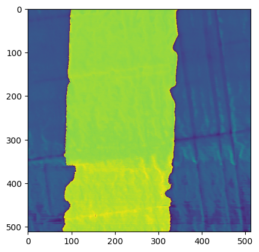
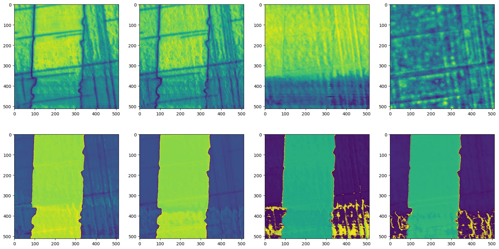
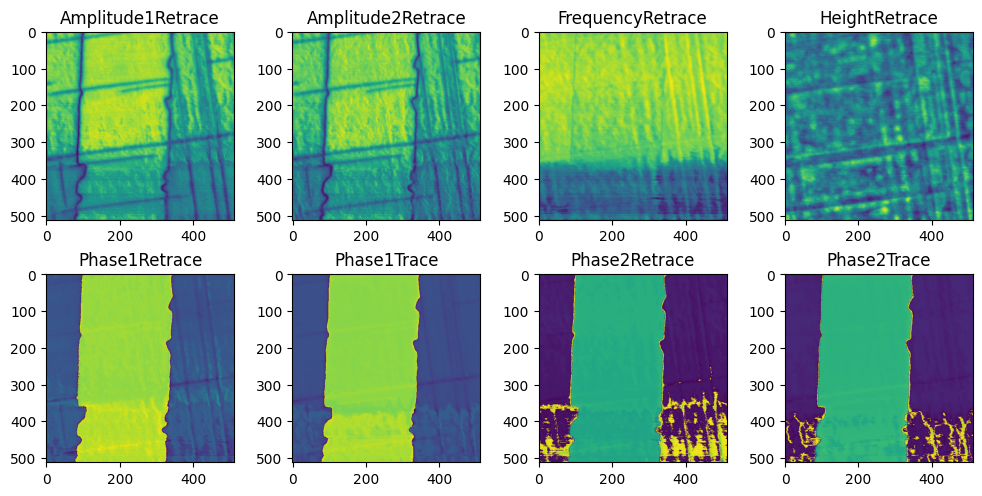
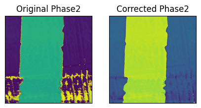
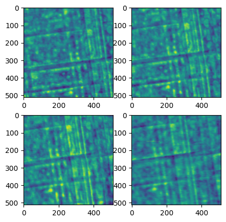
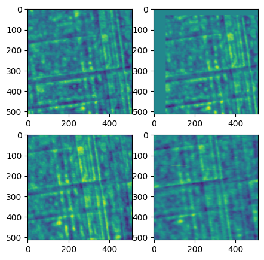
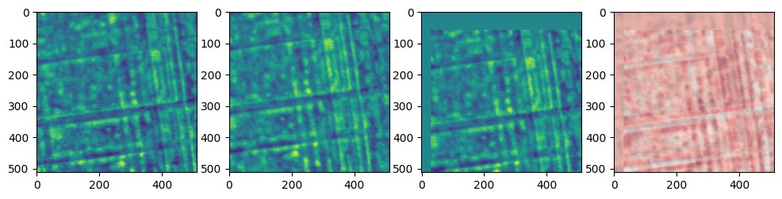

```python
from hystorian.io import HyFile, HyPath

from pathlib import Path
import numpy as np
import matplotlib.pyplot as plt
import glob
```


```python
import os
# Cleanup the environment:
os.remove('pfm1.hdf5') if os.path.exists('pfm1.hdf5') else None
os.remove('pfm2.hdf5') if os.path.exists('pfm2.hdf5') else None
```


```python
datapath2 = Path("data/SD_P4_zB5_050mV_-2650mV_0006.ibw")
```

# How to extract the data?

## Using `HyExtractor`

The simplest (but not recommended) way to extract the data is to use the `HyExtractor` class. It will extract the data from a supported file and return a dictionary with the data, metadata, and attributes.

```python
from hystorian.io import HyExtractor
datapath1 = "path/to/your/file.hystorian"
d = HyExtractor.extract(datapath1)
```

To access the data, metadata, and attributes, you can use the following attributes:

```python
d.data        # The data extracted from the file
d.metadata    # The metadata of the file
d.attributes  # The attributes of the file
```

This can be used for quick and dirty extraction of the data, during the exploratory phase of your project. However, it is not recommended for production code, as it does not allow to store the future processing in the same file, and does not allow to store the data in a structured way.

### Using `HyFile`

The proper way to extract the data is to use the `HyFile` class. It allows to store the data, metadata, and attributes in a structured way, and allows to store the future processing in the same file.

HyFile as a `__enter__` and `__exit__` methods, so it can be used in a `with` statement. This will ensure that the file is properly closed after the processing is done.

HyFile support the following modes to open the file:
- `r`: Readonly, file must exist. (default)
- `r+`: Read/write, file must exist.
- `w`: Create file, truncate if exists.
- `w-` or `x`: Create file, fail if exists.
- `a` : Read/write if exists, create otherwise.

(Note: Due to a bug, `r+` works like `a` in the current version of Hystorian, this will be fixed soon)


```python
with HyFile('pfm1.hdf5', 'a') as f: # The file did not exist before so it is created
    ... # We do nothing
```

Now, to add the data from an IBW file to a HDF5 file, you can use the following code:


```python
datapath1 = Path("data/SD_P4_zB5_050mV_-2550mV_0002.ibw") # This is the path to the IBW file you want to add

with HyFile('pfm1.hdf5', 'r+') as f:
    f.extract_data(datapath1)

```

Using `merge()` it is possible to merge two hdf5 files together.


```python
datapath2 = Path("data/SD_P4_zB5_050mV_-2650mV_0006.ibw") # This is the path to the IBW file you want to add

with HyFile('pfm2.hdf5', 'r+') as f:
    f.extract_data(datapath2)

with HyFile('pfm1.hdf5', 'r+') as f:
    f.merge('pfm2.hdf5')
    os.remove('pfm2.hdf5')
```

# How to read the data?

And now `pfm1.hdf5` contains the data from the IBW file, and you can access it using the `HyFile` class, and the `read(path = None, search = False)` method.

`path` is the path to the Group or Dataset you want to read. If the value is None, read the root of the folder. If the path lead to Groups, it will return a list of the subgroups, if it lead to a Dataset, it will return the data as a numpy array.


```python
with HyFile('pfm1.hdf5', 'r+') as f:
    print(f.read())
    print(f.read('datasets'))
    print(f.read('datasets/SD_P4_zB5_050mV_-2550mV_0002'))
    plt.imshow(f.read('datasets/SD_P4_zB5_050mV_-2550mV_0002/Phase1Retrace'))

```

    ['datasets', 'metadata', 'process']
    ['SD_P4_zB5_050mV_-2550mV_0002', 'SD_P4_zB5_050mV_-2650mV_0006']
    ['Amplitude1Retrace', 'Amplitude2Retrace', 'FrequencyRetrace', 'HeightRetrace', 'Phase1Retrace', 'Phase1Trace', 'Phase2Retrace', 'Phase2Trace']





You can set `search=True` to search all the datasets which match with the string you pass. For example `read('datasets/*', search=True)` will return all the datasets in the `datasets` group.
You can also use the `path_search(path)` method to search for a path in the file. It will return a list of all the paths which match with the string you pass.
Both `read()` and `path_search()` methods uses regex formatting. I would recommend using https://regex101.com/ to check your regex rule. Something to be carefull is the distinction between `*` and `.*`.


```python
with HyFile('pfm1.hdf5', 'r+') as f:
    print(f.path_search('datasets/.*'))
    print(np.shape(f.read('datasets/.*', search=True)))
```

    [HyPath('datasets/SD_P4_zB5_050mV_-2550mV_0002/Amplitude1Retrace'), HyPath('datasets/SD_P4_zB5_050mV_-2550mV_0002/Amplitude2Retrace'), HyPath('datasets/SD_P4_zB5_050mV_-2550mV_0002/FrequencyRetrace'), HyPath('datasets/SD_P4_zB5_050mV_-2550mV_0002/HeightRetrace'), HyPath('datasets/SD_P4_zB5_050mV_-2550mV_0002/Phase1Retrace'), HyPath('datasets/SD_P4_zB5_050mV_-2550mV_0002/Phase1Trace'), HyPath('datasets/SD_P4_zB5_050mV_-2550mV_0002/Phase2Retrace'), HyPath('datasets/SD_P4_zB5_050mV_-2550mV_0002/Phase2Trace'), HyPath('datasets/SD_P4_zB5_050mV_-2650mV_0006/Amplitude1Retrace'), HyPath('datasets/SD_P4_zB5_050mV_-2650mV_0006/Amplitude2Retrace'), HyPath('datasets/SD_P4_zB5_050mV_-2650mV_0006/FrequencyRetrace'), HyPath('datasets/SD_P4_zB5_050mV_-2650mV_0006/HeightRetrace'), HyPath('datasets/SD_P4_zB5_050mV_-2650mV_0006/Phase1Retrace'), HyPath('datasets/SD_P4_zB5_050mV_-2650mV_0006/Phase1Trace'), HyPath('datasets/SD_P4_zB5_050mV_-2650mV_0006/Phase2Retrace'), HyPath('datasets/SD_P4_zB5_050mV_-2650mV_0006/Phase2Trace')]
    (16, 512, 512)


Using `search=True` allows for an easy way to access all datasets in a group without having to know their exact names.


```python
fig, axes = plt.subplots(2, 4, figsize=(20, 10))
axes = axes.flatten()

with HyFile('pfm1.hdf5', 'r') as f:
    for i, d in enumerate(f.read('datasets/.*2550mV_0002.*', search=True)):
        axes[i].imshow(d)
```





Using path_search instead of read(path, search=True) allows you to get the paths of the datasets, which can be useful if you want to access the datasets later, or if you want to display the names of the datasets in a plot for example.


```python
fig, axes = plt.subplots(2, 4, figsize=(10, 5))
axes = axes.flatten()

with HyFile('pfm1.hdf5', 'r') as f:
    for i, p in enumerate((f.path_search('datasets/.*2550mV_0002.*'))):
        d = f.read(p)
        axes[i].imshow(d)
        axes[i].set_title(p.stem)
plt.tight_layout()
```





# How to modify the data?

As you can see the Phase2 channel has a case of phase unwrapping. Here I'll show you how to use one of the many tools in hystorian to correct this issue, and how to store the processing in the hdf5 file.

The easiest way is to simply manipulate the numpy array provided by the `read()` method, however this is not the recommended way to do it, as it does not allow to store the processing in the file. It is still usefull though during the exploratory phase of your project, to avoid writting a lot of test manipulations into the hdf5 file.


```python
from hystorian.processing import spm
```


```python
with HyFile('pfm1.hdf5', 'r') as f:
    phase2 = f.read('datasets/SD_P4_zB5_050mV_-2550mV_0002/Phase2Retrace')

corrected_phase2 = spm.shift_and_wrap_phase(phase2)

```


```python
fig, axes = plt.subplots(1, 2, figsize=(5, 2.5))
axes[0].imshow(phase2)
axes[0].set_title('Original Phase2')
axes[1].imshow(corrected_phase2)
axes[1].set_title('Corrected Phase2')

axes[0].set_xticks([])
axes[0].set_yticks([])
axes[1].set_xticks([])
axes[1].set_yticks([])
```


    []





Now that we have a process that work well, we want to save it into the hdf5 file. To do so we will use the `apply()` method of the `HyFile` class. This method allows to apply a function to a dataset, and store the result in the file.

<div class="alert alert-block alert-danger">
<b>Warning: </b> Something to be carefull of, is that when you use `apply()` you <b> CANNOT </b> pass a string as the path of the dataset, you must use a `HyPath` object. This is because the `apply()` can take any function as first argument, and some of these functions may need a string as an argument, so it is necessary to differentiate between an arbitrary string and a path to a dataset.
</div>


```python
with HyFile('pfm1.hdf5', 'r+') as f:
    f.apply(spm.shift_and_wrap_phase, HyPath('datasets/SD_P4_zB5_050mV_-2550mV_0002/Phase2Retrace'))
```

However we would like to modify all the datasets that contain a phase. Thankfully, it is straightforward to do so using `multiple_apply()` and `path_search()`.


```python
with HyFile('pfm1.hdf5', 'r+') as f:
    f.multiple_apply(spm.shift_and_wrap_phase, f.path_search("datasets.*Phase.*"))
```

The issue now is that we have a folder in `process` that is useless. Thankfully it is easy to delete a folder in the hdf5 file using the `delete()` method of the `HyFile` class. This method allows to delete a path from the file, and if you set `renumber=True`, it will renumber the paths in process after the deleted path.


```python
with HyFile('pfm1.hdf5', 'r+') as f:
    f.delete(1, renumber=True)
    # Equivalent to:
    # f.delete(f.path_search("process.*001.*")[0], renumber=True)

```

### Distortion Correction


```python
from hystorian.processing.distortion import find_transform
from hystorian.processing.distortion import custom_warp as hywarp
import skimage
```


```python
filelist = glob.glob('data/*.ibw')

os.remove('distort_demo.hdf5') if os.path.exists('distort_demo.hdf5') else None
with HyFile('distort_demo.hdf5', 'r+') as f:
    for file in filelist:
        f.extract_data(file)
```


```python
with HyFile('distort_demo.hdf5', 'r+') as f:
    heights = f.path_search('datasets.*Height.*')
    increment_proc = True
    for height in heights:
        f.apply(find_transform, heights[0], height, method="ECC", motion_type="translation", increment_proc=increment_proc, output_names='/'.join(height.path.split('/')[1:-1]))
        if increment_proc:
            increment_proc = False

```


```python
with HyFile('distort_demo.hdf5', 'r+') as f:
    mat_paths = f.path_search('.*find_transform.*')
    for mat_path in mat_paths:
        output_names = ['/'.join(i.split('/')[1:]) for i in f.path_search(f'datasets/.*{mat_path.split('/')[-1]}.*')]
        f.multiple_apply(skimage.transform.warp,
                         f.path_search(f'datasets/.*{mat_path.split('/')[-1]}.*'),
                         inverse_map=f.read(mat_path),
                         output_names = output_names,
                         increment_proc=False)
```


```python
# with HyFile('pfm1.hdf5', 'r+') as f:
#     f.delete(1, renumber=True)
```


```python
fig, axes = plt.subplots(2,2, figsize=(5,5))
axes = np.ravel(axes)

with HyFile('distort_demo.hdf5', 'r') as f:
    for i, h_path in enumerate(f.path_search('.*datasets.*HeightRetrace')):
        axes[i].imshow(f.read(h_path))

```





```python
fig, axes = plt.subplots(2,2, figsize=(5,5))
axes = np.ravel(axes)

with HyFile('distort_demo.hdf5', 'r') as f:
    for i, h_path in enumerate(f.path_search('.*process.*warp.*HeightRetrace')):
        print(f.read(h_path))
        axes[i].imshow(f.read(h_path))
```

    [[-5.9571147e-11 -1.3170455e-10 -1.5449851e-10 ...  6.2811208e-11
       1.1257702e-10  1.7672402e-10]
     [ 1.8672099e-11  5.6542479e-12 -3.3908553e-11 ...  1.0140819e-10
       1.8539392e-10  2.3228995e-10]
     [-2.1392725e-10 -1.6703229e-10 -1.0325525e-10 ... -5.3771970e-11
      -4.8009335e-12  2.8537898e-11]
     ...
     [ 8.6825441e-10  9.6599706e-10  9.5496944e-10 ...  8.8391516e-11
      -3.3935521e-11 -1.9062441e-10]
     [ 8.9940455e-10  1.0442989e-09  1.1717133e-09 ...  2.7432634e-10
      -6.7927886e-12 -1.8107471e-10]
     [ 6.2661315e-10  6.8260414e-10  7.4578566e-10 ...  2.2788527e-10
       1.2082069e-10 -7.0258466e-11]]
    [[ 0.00000000e+00  0.00000000e+00  0.00000000e+00 ...  0.00000000e+00
       0.00000000e+00  0.00000000e+00]
     [ 0.00000000e+00  0.00000000e+00  0.00000000e+00 ...  0.00000000e+00
       0.00000000e+00  0.00000000e+00]
     [ 0.00000000e+00  0.00000000e+00  0.00000000e+00 ...  0.00000000e+00
       0.00000000e+00  0.00000000e+00]
     ...
     [ 0.00000000e+00  0.00000000e+00  0.00000000e+00 ...  1.64443445e-10
      -8.86846221e-11 -2.79999468e-10]
     [ 0.00000000e+00  0.00000000e+00  0.00000000e+00 ...  1.08510756e-10
      -3.73032195e-11 -1.97824604e-10]
     [ 0.00000000e+00  0.00000000e+00  0.00000000e+00 ... -1.58442669e-11
      -1.32188857e-10 -2.37133452e-10]]
    [[-3.3958258e-10 -3.3884362e-10 -2.7500846e-10 ... -8.3389295e-10
      -8.7871399e-10 -8.7621288e-10]
     [-4.0967052e-10 -4.0375880e-10 -4.0432724e-10 ... -8.4426688e-10
      -8.3659302e-10 -7.8352969e-10]
     [-3.9059955e-10 -3.7610448e-10 -3.9722181e-10 ... -9.4013330e-10
      -9.2495611e-10 -9.4448183e-10]
     ...
     [ 4.3115733e-11  1.2471446e-10  9.6946451e-11 ... -7.4581408e-10
      -8.7112539e-10 -8.9221430e-10]
     [ 5.7610805e-11  1.4571810e-10  1.3287149e-10 ... -6.8143891e-10
      -6.7322503e-10 -7.8861717e-10]
     [ 1.4875923e-10  9.1091579e-11  1.5569412e-10 ... -7.6244078e-10
      -7.8563289e-10 -7.2839157e-10]]
    [[-6.86668500e-11 -1.15790044e-10 -9.65201252e-11 ... -2.35644393e-10
      -2.41044518e-10 -2.36468622e-10]
     [ 5.28643795e-12  1.18234311e-11  1.73372428e-11 ... -2.63582933e-10
      -2.99792191e-10 -3.12041948e-10]
     [ 6.99742486e-11  6.83257895e-11  1.29347200e-10 ... -2.36923370e-10
      -1.87810656e-10 -1.29830369e-10]
     ...
     [-1.52425628e-10 -3.00872216e-10 -3.28981287e-10 ... -3.75223408e-10
      -3.28299166e-10 -2.74269496e-10]
     [-1.56148872e-10 -1.69450232e-10 -1.71553438e-10 ... -1.17552190e-10
      -9.22284471e-11 -5.26085842e-11]
     [-2.68414624e-10 -2.28141062e-10 -2.54885890e-10 ...  1.31365141e-10
       9.55537871e-11  9.39905931e-11]]





```python
with HyFile('distort_demo.hdf5', 'r+') as f:
    mat_path = f.path_search('.*find_transform.*2650mV.*')[0]
    image1 = f.read('datasets.*2550mV.*Height', search=True)[0,:,:]
    image2 = f.read('datasets.*2650mV.*Height', search=True)[0,:,:]
    mat = f.read(mat_path)
```


```python
np.shape(mat)
```


    (3, 3)


```python
fig, axes = plt.subplots(1,4, figsize=(12,3))
axes = np.ravel(axes)
axes[0].imshow(image1)
axes[1].imshow(image2)
axes[2].imshow(hywarp(image2, mat))
axes[3].imshow(image1, alpha=0.5, cmap='Blues')
axes[3].imshow(hywarp(image2, mat), alpha=0.5, cmap='Reds')


```


    <matplotlib.image.AxesImage at 0x1e5f122b4d0>





```python
warp(image, mat)
```


    array([[ 1.8673063e-11,  5.6559202e-12, -3.3907099e-11, ...,
             1.0140866e-10,  1.8539481e-10,  0.0000000e+00],
           [ 1.8673063e-11,  5.6559202e-12, -3.3907099e-11, ...,
             1.0140866e-10,  1.8539481e-10,  0.0000000e+00],
           [ 1.8673063e-11,  5.6559202e-12, -3.3907099e-11, ...,
             1.0140866e-10,  1.8539481e-10,  0.0000000e+00],
           ...,
           [ 1.8673063e-11,  5.6559202e-12, -3.3907099e-11, ...,
             1.0140866e-10,  1.8539481e-10,  0.0000000e+00],
           [ 1.8673063e-11,  5.6559202e-12, -3.3907099e-11, ...,
             1.0140866e-10,  1.8539481e-10,  0.0000000e+00],
           [ 1.8673063e-11,  5.6559202e-12, -3.3907099e-11, ...,
             1.0140866e-10,  1.8539481e-10,  0.0000000e+00]],
          shape=(512, 512), dtype=float32)


```python
image
```


    array([[-5.9571903e-11, -1.3170620e-10, -1.5450041e-10, ...,
             6.2811978e-11,  1.1257839e-10,  1.7672619e-10],
           [ 1.8673063e-11,  5.6559202e-12, -3.3907099e-11, ...,
             1.0140866e-10,  1.8539481e-10,  2.3229063e-10],
           [-2.1393021e-10, -1.6703439e-10, -1.0325607e-10, ...,
            -5.3773874e-11, -4.8032689e-12,  2.8535396e-11],
           ...,
           [ 8.6825480e-10,  9.6599706e-10,  9.5496944e-10, ...,
             8.8391516e-11, -3.3935521e-11, -1.9062441e-10],
           [ 8.9940499e-10,  1.0442989e-09,  1.1717134e-09, ...,
             2.7432634e-10, -6.7927886e-12, -1.8107471e-10],
           [ 6.2661343e-10,  6.8260420e-10,  7.4578566e-10, ...,
             2.2788527e-10,  1.2082069e-10, -7.0258466e-11]],
          shape=(512, 512), dtype=float32)


```python
mat
```


    array([[-1.76798225e-13,  2.22044605e-16,  1.00000000e+00],
           [ 1.17873968e-13,  1.00000000e+00,  1.11022302e-16]])


```python

```
